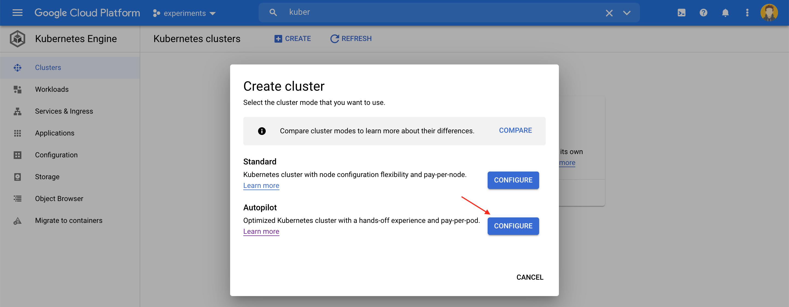

## Kubernetes Env

- If you don't have a kubernetes environment, you can create a new kubernetes cluster on Google Cloud(`Autopilot mode` is the cheapest - under $1)
- Head over to [Google Cloud Console](https://console.cloud.google.com) and create a new kubernetes cluster in `Autopilot` mode. 

## Tools

- [Visual Studio Code](https://code.visualstudio.com)
- [.NET 5](https://dotnet.microsoft.com)
- [Docker](https://www.docker.com/get-started)
- [Kubectl](https://kubernetes.io/docs/tasks/tools/)
- [Skaffold](https://skaffold.dev)

## Getting started

- Open directory `shopping-microservice` inside [Visual Studio Code](https://code.visualstudio.com)
- `code shopping-microservice`
- Review [shopping-microservice/Readme.md](shopping-microservice/Readme.md)
