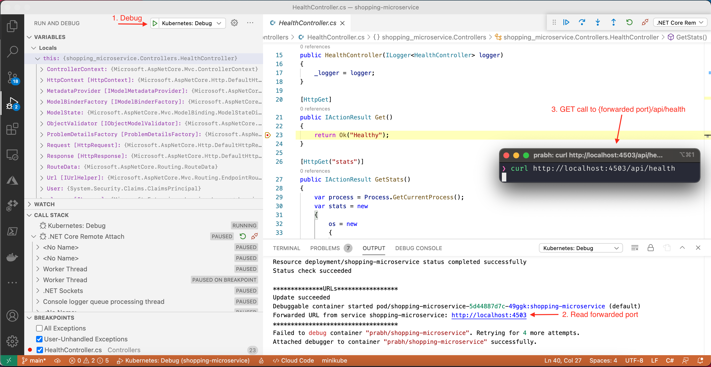
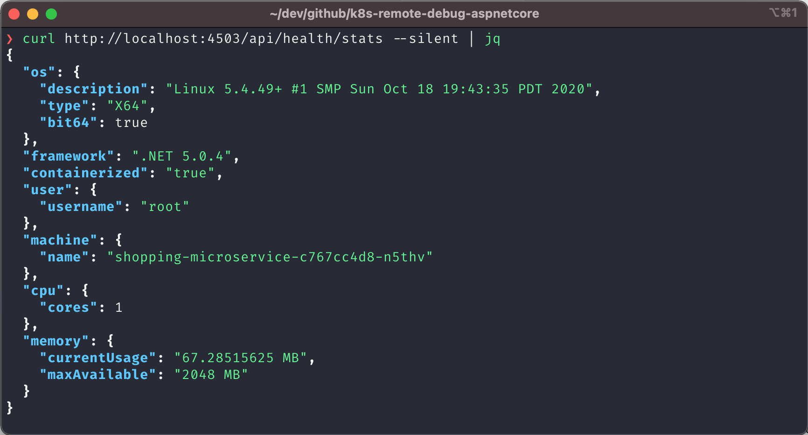

## System information

If your machine doesn't have below listed tools, then the program might fail to run. It is advised that you install tools with same major version on your machine.

```bash
❯ dotnet --list-sdks
5.0.x

❯ docker --version
Docker version 20.10.5
# docker login

❯ skaffold version
v1.21.0

❯ kubectl version --short
Client Version: v1.20.4-dirty
Server Version: v1.18.12-gke.1210

❯ code --version
1.54.3

❯ code --list-extensions --show-versions | grep -e cloudcode -e csharp -e docker
googlecloudtools.cloudcode@1.9.0
ms-azuretools.vscode-docker@1.11.0
ms-dotnettools.csharp@1.23.9

```

## Getting started

- Review `.vscode/launch.json`, `skaffold.yaml` and `k8s/deployment.yml` files and update image name (Replace all occurences of prabh with your docker username)
- Start debugging(If you don't see debug profile, make sure that root directory is `shopping-microservice` in VSCode). 
- `curl http://localhost:4503/api/health/stats --silent | jq` 
